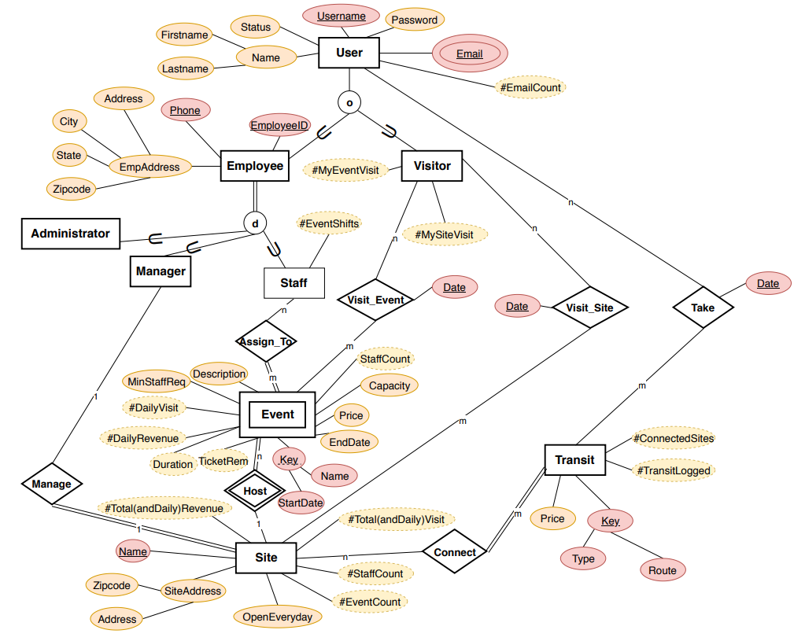

# Table of Contents
# General Info
The BeltLine project is an app that allows users to view sites, take transits, go to events and more. 
The BeltLine project is based on the Atlanta BeltLine.
This is a semester long project in class CS4400.
# Technologies Used
- Java
- MySQL
- Scene Builder
# Setup
# Running the Project
# UI
# ER Diagram

# Schema

